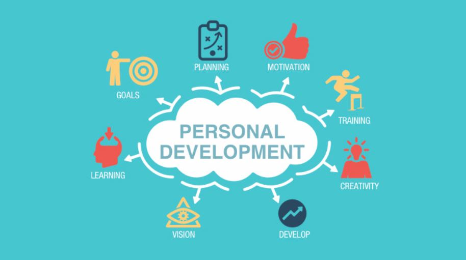

<!--  -->
<kbd></kbd>

    
# PYTHON PROGRAMMING
 -  THIS IS MY PYTHON REPOSITORY WHERE YOU CAN FIND A LOT OF PROGRAMS ON PYTHON.
# LICENSE

## Authors

- [@Manmay Chakraborty](https://www.github.com/manmay2)

## 🚀 About Me
Hi, I am Manmay Chakraborty who is currently executing python codes in this repository.

## Feedback

If you have any feedback, feel free to reach out at manmaycoder@gmail.com

## 🛠 Skills
Javascript, HTML, CSS,C,C++,PYTHON and JAVA
